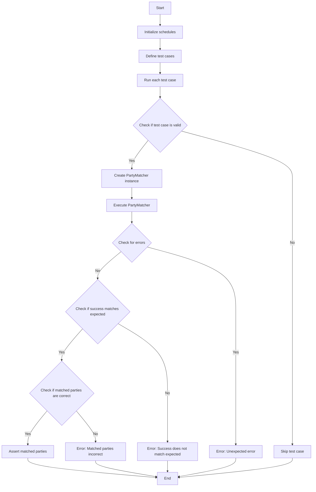

```mermaid
graph TD
    A[Start] --> B[Initialize schedules]
    B --> C[Define test cases]
    C --> D[Run each test case]
    D --> E{Check if test case is valid}
    E -->|Yes| F[Create PartyMatcher instance]
    F --> G[Execute PartyMatcher]
    G --> H{Check for errors}
    H -->|No| I{Check if success matches expected}
    I -->|Yes| J{Check if matched parties are correct}
    J -->|Yes| K[Assert matched parties]
    J -->|No| L[Error: Matched parties incorrect]
    I -->|No| M[Error: Success does not match expected]
    H -->|Yes| N[Error: Unexpected error]
    E -->|No| O[Skip test case]
    K --> P[End]
    L --> P
    M --> P
    N --> P
    O --> P
```
