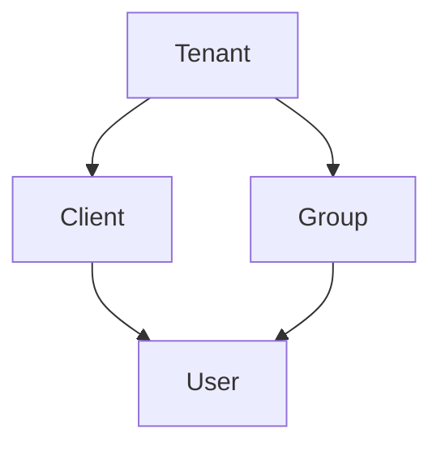

Tenacity Scheme:

## Domain-Driven Design for a Team-vs-Team Matchmaking System

### Bounded Contexts

**1. Matchmaking**
* **Core Responsibilities:**
   - Managing player and team queues.
   - Applying matchmaking algorithms to pair suitable teams.
   - Scheduling matches.
   - Handling matchmaking preferences and constraints.
* **Upstream:**
   - Game Server: Receives match details and player information.
   - Player Profile Service: Fetches player data (skill rating, preferences, etc.).
* **Downstream:**
   - Game Server: Sends match details to initiate the game.
   - Player Profile Service: Updates player statistics and preferences.

**2. Player Profile**
* **Core Responsibilities:**
   - Storing and managing player profiles.
   - Calculating and updating player skill ratings.
   - Tracking player preferences and settings.
* **Upstream:**
   - Matchmaking: Fetches player data for matchmaking decisions.
* **Downstream:**
   - Matchmaking: Updates player statistics and preferences after matches.

### Domain Entities and Responsibilities

**Matchmaking Domain:**

* **Lobby:**
   (?) Possible Region(Locale), Place(), 
* **Pool:**
   √ A subset of players or teams within a lobby, often filtered by specific criteria.
* **Pair:**
   √ Represents a pair of teams matched for a game.
   √ Stores information about the matched teams, the scheduled time, and other relevant details.
* **Inquiry:**
   √ A request from a player or team to be matched.
   (?) Includes information about the player's or team's preferences and constraints.
* **Commitment:**
   √ A player or team's commitment to a specific match.
   √ Involves accepting a match offer or declining it.
* **Notification:**
   √ A message sent to players or teams about match-related information.
* **Party:**
   √ A group of players who queue together as a team.
* **Peer:**
   √ An individual player within a party.
* **Schedule:**
   X A plan for a sequence of matches.
   X Includes information about match times, durations, and locations.
* **Appointment:**
   X A specific match scheduled for a particular time and duration.
* **Availability:**
   √ The times when a player or team is available to play.
* **Constraint:**
   √ A limitation or restriction on a player's or team's availability or preferences.
* **Invitation:**
   √ A manual invitation for a user to join a match or event.
   √ Supports status tracking (Pending, Accepted, Declined, Expired, Revoked).
* **ExternalInvitation:**
   √ A manual invitation for an external user (not yet on the platform) to join a match or event.
   √ Includes email validation, registration token generation, and automatic platform membership upon acceptance.
* **Notification:**
   √ A notification sent to users via multiple channels (in-app, email, SMS).
   √ Supports status tracking (Pending, Sent, Failed, Retrying), retry policies, and user preferences.
* **NotificationTemplate:**
   √ A reusable template for notifications with support for variables and multiple languages.
* **UserNotificationPreferences:**
   √ User preferences for notifications including enabled/disabled channels, do not disturb times, and type preferences.
